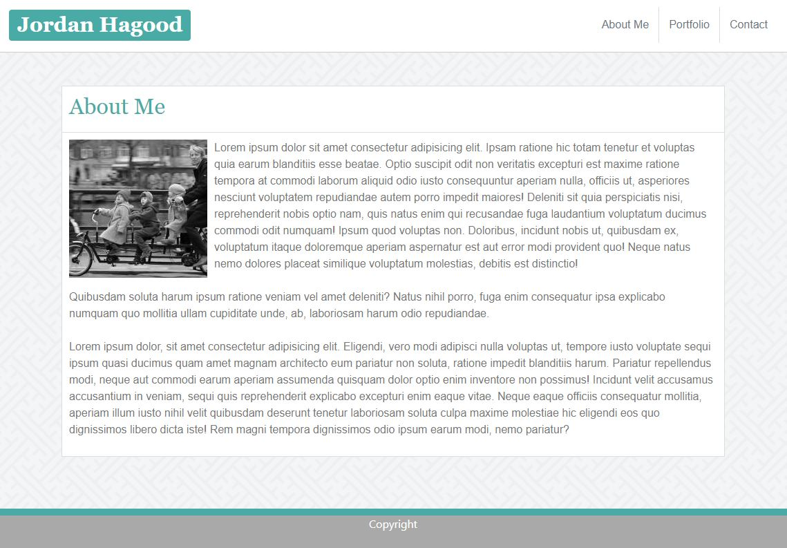

# Bootstrap Portfolio

## Site Picture


## Technologies Used 
- HTML - Used to create elements on the DOM
- CSS - styles html elements on page 
- Git - version control system to track changes to source code
- Github - hosts repository that can be deployed to GitHub pages

## Summary
This is my portfolio created using components and layouts from Bootstrap. These components and layouts were modified to suit the requirements of this assignment.

## Code Snippet
The following code shows the modified navigation bar: 
```html
<nav class="navbar navbar-expand-sm navbar-light bg-light">
    <h1><span class="badge badge-primary">Jordan Hagood</span></h1>
    <button class="navbar-toggler" type="button" data-toggle="collapse" data-target="#navbarNav" aria-controls="navbarNav" aria-expanded="false" aria-label="Toggle navigation">
        <span class="navbar-toggler-icon"></span>
    </button>
    <div class="collapse navbar-collapse justify-content-end" id="navbarNav">
        <ul class="navbar-nav">
        <li class="nav-item">
            <a href="./index.html" class="nav-link text-secondary">About Me</a>
        </li>
        <li class="nav-item">
            <a href="./portfolio.html" class="nav-link text-secondary">Portfolio</a>
        </li>
        <li class="nav-item">
            <a href="./contact.html" class="nav-link text-secondary">Contact</a>
        </li>
        </ul>
    </div>
</nav>
```
The following code shows the use of a container to display the contents of the portfolio tab:
```html
<div class="container bg-white">
    <div class = "row row1">
        <h2>Portfolio</h2> 
    </div>
    <div class = "row projects">
        <div class = "col-md-4 col-sm-6 col-xs-12">
            <div class= "row justify-content-md-center projectrows">
                <a href="https://hagoodj.github.io/hw-wireframe/"></a>
                <h6 class = "labels">Website Layout</h6>
            </div>
        </div>
        <div class = "col-md-4 col-sm-6 col-xs-12">
            <div class= "row justify-content-md-center projectrows">
                <a href="https://hagoodj.github.io/hw-wireframe2/"></a>
                <h6 class = "labels">Portfolio Project</h6>
            </div>                
        </div>
        <div class = "col-md-4 col-sm-6 col-xs-12">
            <div class= "row justify-content-md-center projectrows">
                <a href="https://hagoodj.github.io/bootstrap-portfolio/"></a>
                <h6 class = "labels">Bootstrap Portfolio</h6>
            </div>
        </div>    
    </div>        
</div>                       
```
## Author Links
https://github.com/hagoodj